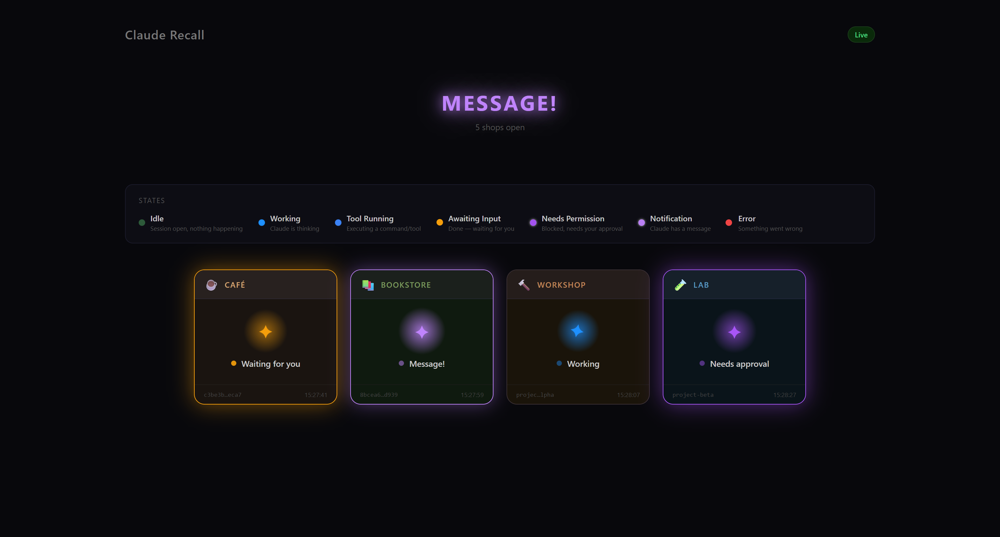
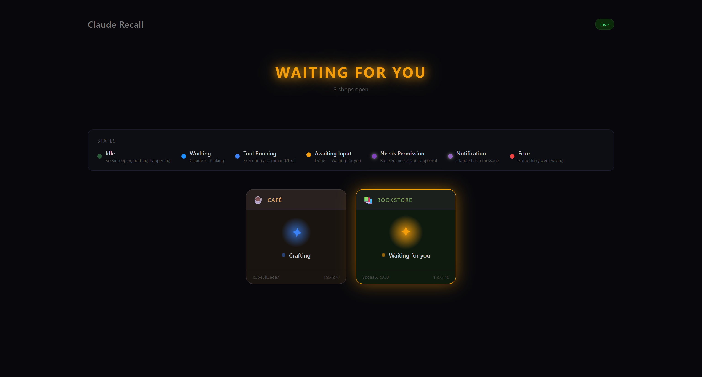
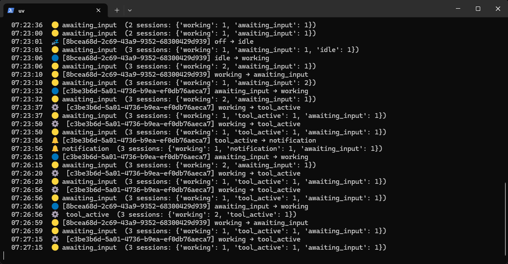

# Claude Recall

> **Bring humans back into the Claude Code loop.**

Claude Recall tracks the state of all your Claude Code sessions in real-time and alerts you via lights, dashboards, or phone notifications when Claude finishes, needs permission, or hits an error — so you don't have to stare at the terminal.

> [中文版](./README.md)



## What it does

When Claude Code is running in the background:

- **Claude finished** → Orange alert, you can come back
- **Claude needs permission** → Purple pulse, it's blocked until you approve
- **Claude errored** → Red warning
- **Claude is working** → Blue breathing, relax

Tracks multiple concurrent sessions, each displayed independently.

## 30-second setup

```bash
# 1. Clone
git clone https://github.com/yourname/Claude-Recall.git
cd Claude-Recall

# 2. Install
uv sync

# 3. Configure Claude Code hooks (global, applies to all projects)
mkdir -p ~/.claude-recall/hooks
cp hooks/emit.py ~/.claude-recall/hooks/emit.py
```

Merge this into your `~/.claude/settings.json`:

```json
{
  "hooks": {
    "SessionStart": [{"hooks": [{"type": "command", "command": "python3 ~/.claude-recall/hooks/emit.py"}]}],
    "SessionEnd": [{"hooks": [{"type": "command", "command": "python3 ~/.claude-recall/hooks/emit.py"}]}],
    "UserPromptSubmit": [{"hooks": [{"type": "command", "command": "python3 ~/.claude-recall/hooks/emit.py"}]}],
    "Stop": [{"hooks": [{"type": "command", "command": "python3 ~/.claude-recall/hooks/emit.py"}]}],
    "StopFailure": [{"hooks": [{"type": "command", "command": "python3 ~/.claude-recall/hooks/emit.py"}]}],
    "Notification": [{"hooks": [{"type": "command", "command": "python3 ~/.claude-recall/hooks/emit.py"}]}],
    "PreToolUse": [{"hooks": [{"type": "command", "command": "python3 ~/.claude-recall/hooks/emit.py"}]}],
    "PostToolUse": [{"hooks": [{"type": "command", "command": "python3 ~/.claude-recall/hooks/emit.py"}]}]
  }
}
```

**Done!** The daemon auto-starts on first hook trigger. No manual management needed.

## Dashboard

Open the Web Dashboard to see all sessions in real-time:

```bash
cd receivers/web-dashboard
npm install && npx vite
```

Open `http://localhost:5173` in your browser.



Each Claude Code session appears as a unique "shop window" with its own theme. Claude's state is reflected through colors and animations:

| State | Color | Animation | Meaning |
|-------|-------|-----------|---------|
| Idle | Dark green | — | Session exists, nothing happening |
| Working | Blue | Spinning | Claude is thinking |
| Tool Active | Bright blue | Spinning | Running a tool |
| Awaiting Input | Orange | Bouncing | **Done, waiting for you** |
| Needs Permission | Purple | Pulsing glow | **Blocked, needs your approval** |
| Notification | Light purple | Pulsing glow | Claude has a message |
| Error | Red | Shaking | Something went wrong |

## Terminal monitoring

Don't want to open a browser? Use the CLI:

```bash
uv run claude-recall watch --mode all
```



## Architecture

```
Claude Code ──stdin JSON──▶ emit.py ──POST──▶ Core Daemon ──broadcast──▶ Receivers
                                                   │
                                                   ├── WebSocket (dashboard/app)
                                                   ├── Serial (USB light)
                                                   ├── MQTT (IoT devices)
                                                   └── Terminal (bell/title)
```

- **emit.py** — Zero-dependency shim. Reads Claude Code hook stdin (contains session_id), forwards to daemon. Auto-starts daemon on first trigger.
- **Core Daemon** — Maintains per-session state machines, broadcasts state frames. Doesn't care about colors/sounds, only computes state.
- **Receivers** — Connect to daemon, decide how to present each state (colors, animations, sounds, etc.)

## Repository structure

```
core/                State machine + broadcast daemon (Python)
hooks/               Claude Code hook integration
receivers/
  └── web-dashboard/ Browser dashboard (React + TypeScript)
  └── (more)         USB light, Flutter app, WLED...
docs/
  └── protocol.md    State frame protocol (for receiver developers)
```

## CLI commands

```bash
claude-recall daemon              # Start daemon (usually auto-started by hooks)
claude-recall status              # Show aggregate state
claude-recall sessions            # List active sessions
claude-recall watch [--mode all]  # Real-time monitoring
claude-recall test <state> [-s id] # Test state transitions
```

## Building a receiver

Connect to WebSocket and parse JSON state frames:

```python
import asyncio, json, websockets

async def main():
    async with websockets.connect("ws://127.0.0.1:8765/ws") as ws:
        async for msg in ws:
            frame = json.loads(msg)
            print(f"State: {frame['state']}")

asyncio.run(main())
```

See [docs/protocol.md](docs/protocol.md) for the full spec.

## License

MIT
